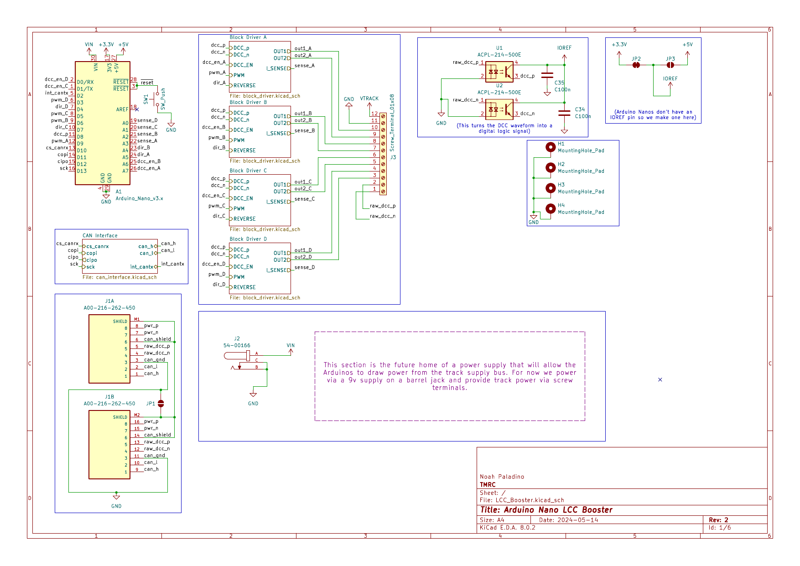
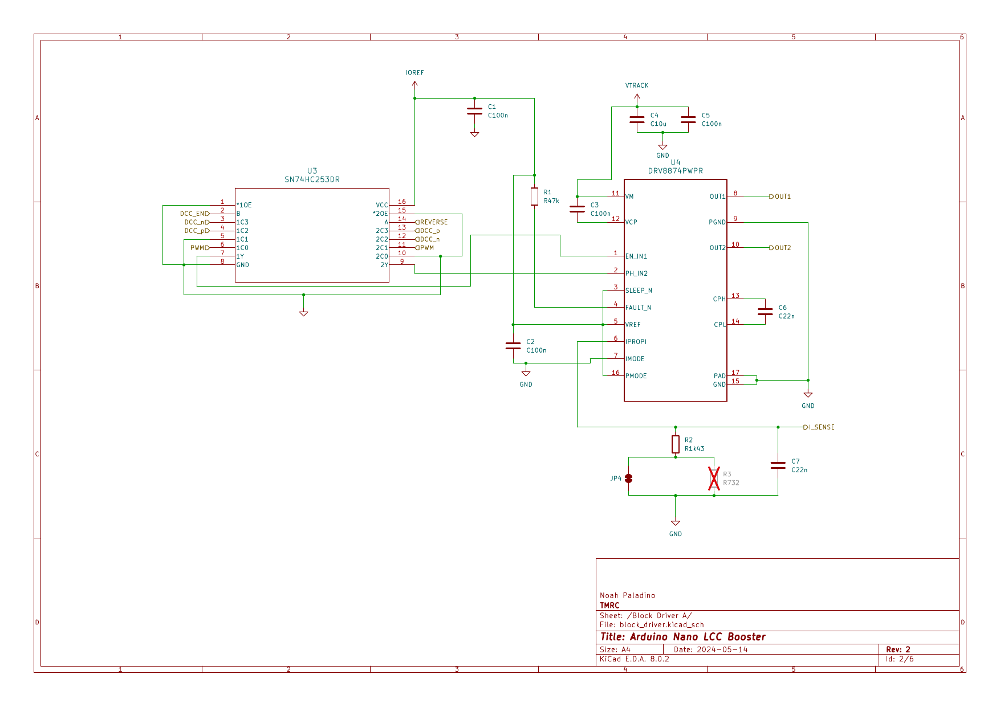

System 4 block cards are designed around a microcontroller that uses the Arduino Nano form factor (and preferably includes an onboard CAN controller, but one can be attached via SPI if need be). Version 2 of the board was primarily designed with [STM32 Nucleo L432KC](https://www.st.com/en/evaluation-tools/nucleo-l432kc.html) microcontrollers in mind, because of their integrated CAN controllers. These boards were heavily inspired by the [DCC-EX motor shield](https://dcc-ex.com/reference/hardware/motorboards/ex-motor-shield-8874.html#gsc.tab=0) and KiCAD source files are available [here](https://github.com/ngpaladi/System4).

## Board Overview

Each block card includes a two-port RJ45 LCC/DCC CAN bus interface, as well as four block driver circuits. Unpopulated pads are left for a MCP2518 CAN controller as well as solder jumpers for 5V logic operation.

## Block Drivers

Each block driver circuit includes options for reversing polarity as well acting as a booster for an external DCC signal. The block drivers are based on the [DRV8874](https://www.ti.com/product/DRV8874) motor driver, which includes current sense, used to determine occupancy and protect against shorts. The blocks are preconfigured for 3.3v logic.

## Additional Information

A second verion of the System 4 block card which fuctions as a shield for an Arduino Uno R4 has also been developed. This version can drive a single block and interface with the main computer software, and is designed to generate the main DCC signal for the layout.

A handy feature of the System 4 Block Cards is that, unlike the System 3 block cards, they can be reflashed with firmware that allows them to function as switch cards, greatly expanding their usability and only requiring one type of board design for the new system.
