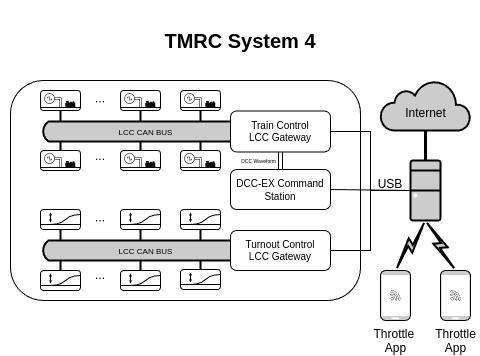

System 4 is currently being developed as a replacement for [System 3](../system3/), the current control system of the Tech Nickel Plate. The design of System 4 revolves around an updated [Block Card](block_cards.html), serving as a carrier board for an Arduino Nano compatible 3.3V microcontroller. 

# Features
 - DCC Support
 - LCC Compliant
 - More Compact [Block Cards](block_cards.html) using Arduino Nano-Format Microprocessors (Easily Upgradable)
 - More Scalable than System 3
 - Compatibility with Commercially Available [Wireless Hardware Throttles](throttles.html) and [Wireless Throttle Apps](throttles.html)
 - [Web-based Layout Control Software](web_control.html)
 - Fully Open Source

# Overview
System4 is based on a LCC "router" software that runs on the main server (acting as a WiFi access point). The System4 server acting as a router saves bandwidth to allow LCC packets and responses to only reach the appropriate LCC CAN bus segment. For example, throttle commands will only be sent to the train control segment (after being processed as necessary). The server will support both Gridconnect and binary LCC over TCP/IP. In the longer term, we hope to add support for additional LCC-USB interfaces (such as the [RR-CirKits LCC Buffer-USB](https://www.rr-cirkits.com/description/LCC-usb-flyer.pdf)). Please note that this plan is still in flux and not settled yet, for example we may switch to USB instead of wireless connections for the CAN segments as testing progresses. A tentative network diagram is shown below.

